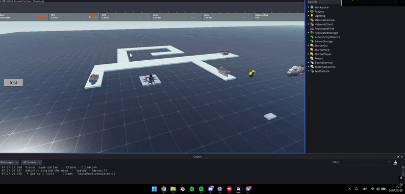

# TD Netcode Framework

Custom ECS-based simulation and binary netcode layer for a tower defense game built around bandwidth-efficient replication, extrapolation, and object pooling.

## Overview

This framework separates authoritative game simulation (server) from rendering/prediction (client), communicating only the minimum data needed over the network. It was built to handle large numbers of moving enemies without the bandwidth or GC overhead that naive roblox networking typically produces.

**Key features:**
- Custom fixed-tick ECS simulation (60Hz sim / 20Hz network flush, decoupled)
- Binary-packed netcode using luau `buffer` instead of table serialization
- Float16 encoding for `progress` / `speed` fields to halve payload size
- Dirty-flag delta replication only entities that changed get sent
- Client-side extrapolation for smooth movement between network ticks
- Reliable vs. unreliable channel separation per message type
- Object pooling for entity IDs and rendered models to avoid GC churn and `Instance` overhead
- Deterministic Catmull-Rom spline pathing, computed independently and identically on server and client


**Core principle:** the server owns the authoritative simulation and never sends 3D positions - only scalar `progress` values along a path. Both server and client reconstruct world-space position locally from the same deterministic spline, so the network only ever carries the minimum state needed to keep both sides in sync.



## Data flow

1. **Wave start** — client fires a `RemoteEvent`, servers `WaveSpawner` transitions its state machine and begins scheduling spawns.
2. **Simulation tick (60Hz)** — server spawns entities into the ECS `World`, advances each enemy's `progress` along its path, applies damage, and marks entities `dirty` when their state changes meaningfully.
3. **Network tick (20Hz)** — `NetworkSync` drains dirty entities into batches, packs them into binary buffers (`Buffers.lua`), and fires them over the appropriate reliable/unreliable remote.
4. **Client receive** — `StateReceiver` unpacks each batch and updates `ClientWorld` (spawn, correct progress, change speed, apply damage, remove on death).
5. **Client render (every frame)** — `Interpolation` extrapolates each enemy's visual position via extrapolation, `AnimationSystem` converts that into a world-space transform via the shared spline sampler and moves the pooled model, `VFXSystem` layers on cosmetic elements.

## Customization
 
Waves are defined declaratively in `WaveDefinitions.lua` — no code changes are needed to add or reshape a wave. A single `WaveGroup` entry supports several shorthand forms that get normalized internally, so simple and complex waves use the same structure.
 
### Single enemy type, single count
```lua
{ enemyType = "template", count = 20 }
```
 
### Multiple enemy types with matching counts
Types and counts are paired by index — useful for mixed waves without writing a separate group per type:
```lua
{ enemyType = {"template", "ind3"}, count = {50, 100} }
-- 50x template, 100x ind3, on a random shared path
```
 
### Spawning on every active path at once
The `onEach` flag repeats the group's spawn count once per registered path, rather than picking a single random path:
```lua
{ enemyType = {"template", "ind3"}, count = {50, 100}, onEach = true }
-- 50x template AND 100x ind3, spawned on EVERY path currently registered
```
 
### Pinning a group to a specific path
```lua
{ enemyType = "ind6", count = 100, pathId = 1 }
```
 
### Per-wave spawn timing
`spawnDelay` and `cooldown` are optional per wave, falling back to sane defaults if omitted:
```lua
[3] = {
    spawns     = { { enemyType = "template", count = 30 } },
    spawnDelay = 0.1,  -- seconds between individual spawns
    cooldown   = 5,    -- seconds before the next wave starts after this one clears
}
```
 
All of this is resolved by `WaveDefinitions.normalizeGroup`, which expands any shorthand (single value, array, `onEach`) into a flat list of `{ enemyType, count }` pairs before `WaveSpawner` builds the actual spawn queue with `PathSelector`. Adding a new enemy type only requires an entry in `EnemyRegistry.Definitions` (model, base HP, base speed, resistances) — the rest of the pipeline (spawning, replication, pooling, animation) picks it up automatically via its `typeId`.

## Optimizations

### Position is never replicated
World-space position is 12+ bytes per entity per update. Instead, only a scalar `progress` (0–1) and `pathId` are synced. Both sides independently sample the same precomputed spline to get identical positions — this is the single biggest bandwidth saving in the system.

### Extrapolation
The client doesnt wait for network updates to move enemies. Every frame it extrapolates:
```lua
renderProgress = syncProgress + speed * (now - syncTime) / pathLength
```
The server only sends a correction when real simulated progress drifts from what the client would predict by more than a small epsilon. Most frames require zero network traffic for movement.

### Decoupled simulation and network rates
Simulation runs at a fixed 60Hz for deterministic gameplay logic; network flushes happen at 20Hz via a separate accumulator in the same loop. Combined with dead reckoning, this reduces network traffic well below a naive "sync every tick" approach.

### Dirty-flag delta replication
Each enemy record tracks independent `dirty`, `speedDirty`, and `hpDirty` flags. Every network tick, only entities whose flags are set get drained, packed, and sent - bandwidth scales with the number of *changes*, not the number of *entities*.

### Binary packing over `buffer`
Instead of sending Lua tables (which carry per-key serialization overhead), all replication data is packed into fixed-width binary layouts by hand — e.g. a spawn entry is `u16 id, u8 pathId, u8 typeId, f16 speed, u16 maxHp` (8 bytes total).

### Float16 encoding
`progress` and `speed` are encoded as IEEE-754 half-precision floats (hand-implemented codec) rather than full 32-bit floats, halving their size. Precision loss is negligible relative to the system's correction threshold.

### Batching with caps and chunking
Changed entities are packed into a single buffer per remote call, up to a configurable batch cap; oversized batches are automatically chunked. This avoids both per-entity call overhead and unbounded packet sizes.

### Reliable vs. unreliable channels
Position corrections are sent over an `UnreliableRemoteEvent` since a dropped packet is quickly superseded by the next one. Spawn, death, damage, and speed-change events - which are critical and can't be "caught up" the same way — use reliable ordered `RemoteEvent`s.

### Entity ID recycling
Freed entity IDs are returned to a pool and reused rather than growing an ever-increasing counter, keeping IDs small enough to fit in a `u16` even during long sessions with thousands of spawns.

### Zero-allocation hot path
Scratch buffers for outgoing batches are allocated once and reused every tick (`table.clear`), avoiding garbage collector pressure in the 60Hz/20Hz loops.

### Client-side model pooling
Enemy `Model` instances are expensive to create/destroy. A pool per enemy type recycles models instead of calling `Instance.new`/`Destroy` on every spawn and death.

### Precomputed spline sampling
The expensive part of spline evaluation - building an arc-length lookup table for uniform-speed traversal - happens once when a path loads. Runtime position queries are an O(log n) binary search over that table rather than re-integrating the curve each time.

## License

See [LICENSE](./LICENSE).
